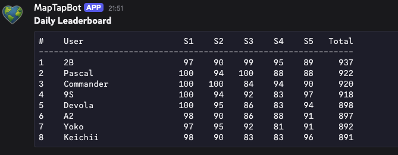
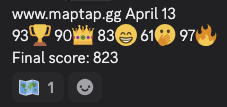
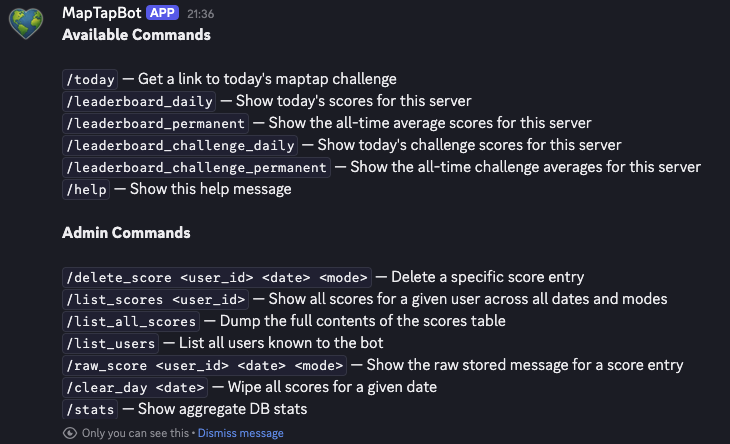

# MapTapBot

A Discord bot for tracking and leaderboarding game scores. Automatically parses game messages, stores scores in a local SQLite database, and provides real-time leaderboards.



## Features

- **Automatic Score Parsing**: Monitors Discord messages for score submissions in multiple formats
- **Score Tracking**: Stores all scores with player names, dates, modes, and scores
- **Leaderboards**: Generate leaderboards for all time, monthly, weekly, and daily rankings
- **Admin Commands**: Delete scores, list user history, and manage the database
- **Channel Filtering**: Optional allowlist to process messages only from specific channels
- **Admin Access Control**: Restrict admin commands to designated Discord users

## Quick Start

### Prerequisites

- Rust 1.70+
- A Discord bot token (create one at [Discord Developer Portal](https://discord.com/developers/applications))

### Installation

1. Clone the repository:
```bash
git clone https://github.com/yourusername/maptapbot.git
cd maptapbot
```

2. Create a `.env` file in the project root:
```env
DISCORD_TOKEN=your_bot_token_here
DATABASE_PATH=maptap.db
DISCORD_CHANNEL_IDS=123456789,987654321
ADMIN_IDS=111111111,222222222
```

3. Build and run:
```bash
cargo build --release
cargo run --release
```

The bot will start and connect to Discord.

## Configuration

### Environment Variables

| Variable | Required | Description |
|----------|----------|-------------|
| `DISCORD_TOKEN` | Yes | Your Discord bot token |
| `DATABASE_PATH` | No | Path to SQLite database (default: `maptap.db`) |
| `DISCORD_CHANNEL_IDS` | No | Comma-separated channel IDs to monitor. If not set, monitors all channels |
| `ADMIN_IDS` | No | Comma-separated Discord user IDs with admin privileges |

### Example Configuration

```env
# Required
DISCORD_TOKEN=MzU0NjUyMzQyNDEyMzQ1MjM0.DPEUMg.abcdefghijklmnopqrstuvwxyz

# Optional - Restrict to specific channels
DISCORD_CHANNEL_IDS=1234567890,0987654321

# Optional - Grant admin access
ADMIN_IDS=123456789,987654321

# Optional - Custom database location
DATABASE_PATH=/var/lib/maptap/scores.db
```

## Usage

### Automatic Score Parsing

The bot automatically monitors messages in Discord and parses score submissions. Just send your scores in the channel and the bot will track them!



The bot recognizes two formats shared directly from [maptap.gg](https://maptap.gg):

**Daily (default) format:**
```
www.maptap.gg April 12
89🎉 82✨ 94🏆 88🎓 97🏅
Final score: 450
```

**Challenge format:**
```
⚡ MapTap Challenge Round - Apr 12
www.maptap.gg/challenge
89🎉 82✨ 94🏆 88🎓 97🏅
Score: 914 in 21.1s (4.0s to spare!)
```

Just paste your results into the monitored channel and the bot reacts with 🗺️ to confirm the score was recorded.

### Commands

#### Leaderboard Commands

```
/today                          — Get a link to today's maptap challenge
/leaderboard_daily              — Show today's scores for this server
/leaderboard_permanent          — Show all-time average scores for this server
/leaderboard_challenge_daily    — Show today's challenge scores for this server
/leaderboard_challenge_permanent — Show all-time challenge averages for this server
/help                           — Show available commands
```


#### Admin Commands

Available only to users in `ADMIN_IDS`:

```
/delete_score user_id:<user_id> date:<YYYY-MM-DD> mode:<mode>
```
Delete a specific score entry.

```
/list_scores user_id:<user_id>
```
View all scores for a specific user.

```
/list_all_scores
```
View entire score database.

```
/list_users
```
Show all registered users.

```
/raw_score user_id:<user_id> date:<YYYY-MM-DD> mode:<mode>
```
Show the raw stored message for a score entry.

```
/invalidate_score message_id:<id>
```
Soft-delete a score entry (sets `invalid = 1`). The row stays in the table but is excluded from leaderboards; if the user previously posted a legit score for the same (guild, date, mode), that earlier row becomes the effective score. Prefer this over `/delete_score` for normal "this score shouldn't count" cases.

```
/stats
```
Show aggregate database stats (total entries, unique users, date range, counts by mode).



## Architecture

### Core Components

- **Handler** (`src/handler.rs`): Processes Discord events and commands
- **Parser** (`src/parser.rs`): Extracts scores from message content
- **Database** (`src/db.rs`): SQLite interface for score storage
- **Models** (`src/models.rs`): Data structures for scores and users

### Database Schema

The bot uses SQLite to store:
- User information (Discord ID, username)
- Score records (player, score, date, mode)
- Timestamps for leaderboard calculations

## Deployment

### Docker

A Dockerfile is included for containerized deployment:

```bash
docker build -t maptapbot .
docker run --env-file .env maptapbot
```

### Production

For production deployments:

1. Use environment variable secrets management (not `.env` files)
2. Mount a persistent volume for the database
3. Configure proper Discord intents and permissions
4. Use a process manager (systemd, supervisor) for reliability

## Development

### Project Structure

```
maptapbot/
├── src/
│   ├── main.rs           # Entry point and bot initialization
│   ├── handler.rs        # Event handlers and command processing
│   ├── parser.rs         # Score message parsing logic
│   ├── db.rs            # SQLite database operations
│   ├── models.rs        # Data structures
│   └── tests/           # Unit tests
├── Cargo.toml           # Rust dependencies
├── Dockerfile           # Container configuration
└── README.md            # This file
```

### Running Tests

```bash
cargo test
```

## Contributing

Contributions are welcome! Please:

1. Fork the repository
2. Create a feature branch
3. Add tests for new functionality
4. Submit a pull request

## Troubleshooting

### Bot doesn't respond to messages

- Verify `DISCORD_TOKEN` is correct
- Check bot permissions in Discord server settings
- Ensure the bot has "Message Content" intent enabled

### Scores not being tracked

- Check that channels are not filtered, or message is in an allowed channel
- Verify message format matches parser patterns
- Check bot logs for parsing errors

### Database errors

- Ensure `DATABASE_PATH` location is writable
- Check for file permissions
- SQLite is bundled into the binary — no separate installation required

## License

MIT License - see LICENSE file for details

## Support

For issues and questions:
- Open an issue on GitHub
- Check existing documentation in `/specs`

---

**Last Updated**: April 2026
